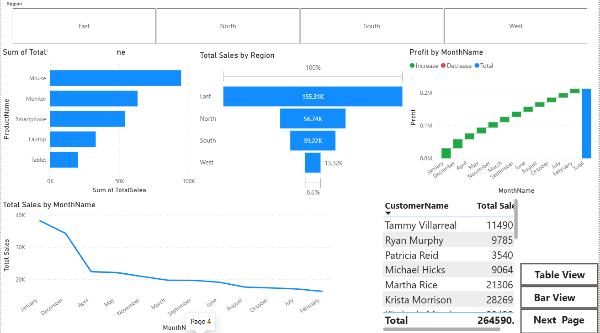
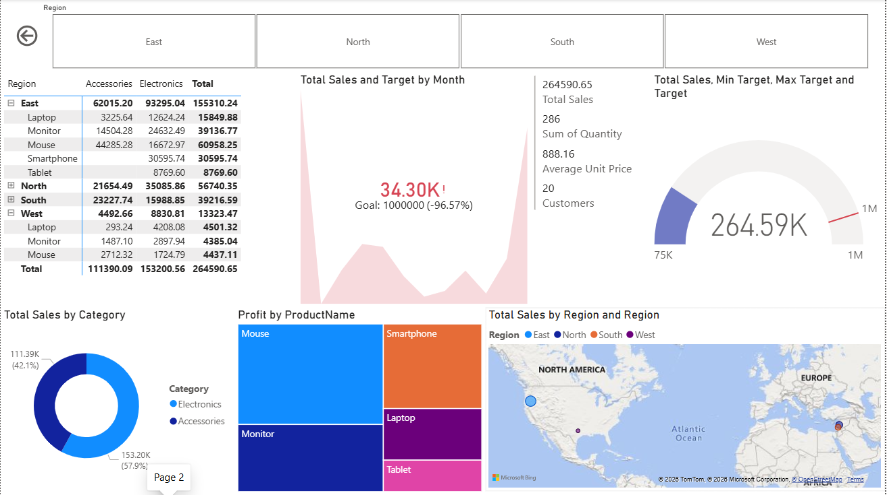

# Sales Analysis Dashboard

## Project Overview
An interactive Power BI dashboard built to analyze sales performance, revenue trends, profit metrics, and regional sales distribution.

## Tools Used
- Power BI
- Power Query
- DAX
- Excel

## Dashboard Preview

### Overview

### Regional Analysis

### Monthly Analysis

## Key KPIs
- Total Sales
- Total Profit
- Total Orders
- Sales by Region
- Monthly Sales Trends

## Key Insights
- Identified top-performing regions.
- Tracked monthly sales growth.
- Compared profitability across categories.
- Highlighted business performance trends.

## Repository Contents
- Sales Dahboards.pbix
- Dashboard-overview.png
- Regional-analysis.png
- Monthly-analysis.png
